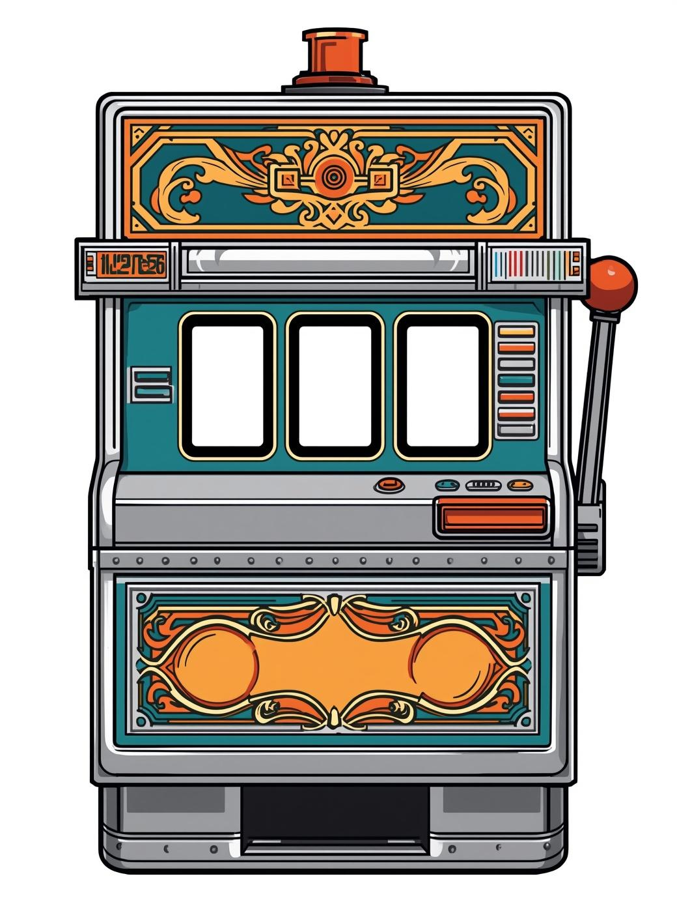

# CLAUDE.md — Bandit Manchot Pédagogique

> Spécification complète pour Claude Code.  
> Lire entièrement avant d'écrire la première ligne de code.

---

## 1. Contexte et objectif

**Nom du projet** : Bandit Manchot Pédagogique  
**Type** : Application web standalone, fichier HTML unique, sans backend  
**Public cible** : Enseignants du CRBTP (Bruxelles), formation professionnelle, dans le cadre du virage numérique 1:1  
**Diffusion** : Communication du vendredi — projeté en réunion, exploré en autonomie, partagé via lien GitHub Pages  
**Objectif pédagogique** : Aider les enseignants à imaginer concrètement comment le déploiement 1:1 peut transformer leurs pratiques existantes, via un format ludique et légèrement absurde qui génère de la discussion  

---

## 2. Concept fonctionnel

Une machine à sous rétro-futuriste à **3 rouleaux** qui génère des combos aléatoires :

```
[ DISCIPLINE ] + [ SITUATION D'APPRENTISSAGE ] + [ CONTRAINTE ]
```

**Exemples de combos** :
- Menuiserie + Évaluation formative + Pas de WiFi
- Cuisine + Travail en équipe + Temps limité (5 min)
- Électricité + Révision avant exam + Élève absent

Après chaque tirage, l'enseignant clique sur **"Révéler la solution"** → l'app appelle l'API Claude pour générer une réponse contextualisée : comment le 1:1 répond à ce combo précis, avec une idée concrète adaptée à la formation professionnelle.

---

## 3. Stack technique

- **Fichier unique** : `index.html` (HTML + CSS + JS inline, pas de bundler)
- **Dépendances externes** : Google Fonts (Oswald + Inter) via CDN uniquement
- **API** : Anthropic `/v1/messages` — modèle `claude-sonnet-4-20250514`
- **Clé API** : Saisie par l'utilisateur au premier lancement, stockée en `sessionStorage` uniquement (jamais `localStorage`)
- **Déploiement cible** : GitHub Pages (aucun serveur requis)
- **Compatibilité** : Chrome, Firefox, Edge — mobile non prioritaire mais responsive acceptable

---

## 4. Design system — RETROFuturisme

Appliquer **strictement** la charte RETROFuturisme v2.0.

### Palette CSS

```css
:root {
  --retro-teal:   #127676;
  --retro-orange: #E4632E;
  --retro-jaune:  #E3A535;
  --retro-ink:    #0D1617;
  --retro-paper:  #F2EFE6;
}
```

### Règles de priorité

| Zone | Couleur |
|------|---------|
| Fond de page | `--retro-ink` (thème sombre — machine dans l'obscurité) |
| Cadre périphérique | `--retro-orange` (4px) + motifs Art Nouveau aux coins |
| Corps de la machine | `--retro-paper` clair avec bordure `--retro-teal` |
| Rouleaux | Fond `--retro-ink`, texte `--retro-jaune`, bordure `--retro-teal` |
| Bouton TIRER | Style pill retrofuturiste — texte jaune + icône orange |
| Bouton RÉVÉLER | Teal dominant — symbolise la validation/découverte |
| Zone réponse IA | `.retro-card` sur fond paper |

### Typographie

- Titres : **Oswald**, MAJUSCULES, `letter-spacing: 0.1em`
- Corps : **Inter** ou `-apple-system`
- Texte dans rouleaux : Oswald 1.4rem minimum

### Cadre Art Nouveau

Motifs floraux SVG aux 4 coins (`color: var(--retro-teal)`, `opacity: 0.5`).  
Le cadre est un `div.page-frame` englobant tout le contenu, **pas `position: fixed`**.

### Bouton pill (TIRER)

```css
.retro-btn-pill { border-radius: 50px; border: 3px solid var(--retro-teal); }
.retro-btn-pill-text { background: var(--retro-jaune); color: var(--retro-ink); }
.retro-btn-pill-icon { background: var(--retro-orange); }
```

---

## 5. Assets visuels — nano banana

Tous les assets d'image sont générés avec **nano banana**.  
Claude Code ne génère **aucun** visuel programmatique en remplacement — il laisse des `` avec les chemins ci-dessous et des `alt` descriptifs précis.

### Assets attendus (à commander dans nano banana)

| Fichier | Description pour nano banana | Dimensions |
|---------|------------------------------|------------|
| `assets/machine-body.png` | Corps d'une machine à sous années 70, style pop-art rétrofuturiste, palette teal/orange/jaune, fond transparent | 400×600px |
| `assets/lever.png` | Levier de machine à sous, métal chromé rétro, années 70, fond transparent | 80×200px |
| `assets/reel-frame.png` | Cadre de rouleau de machine à sous, style art nouveau, ornements teal, fond transparent | 200×280px |
| `assets/bg-pattern.png` | Pattern répétable de circuits imprimés stylisés années 70, dark ink/teal, faible opacité | 400×400px |
| `assets/coin.png` | Pièce de monnaie rétro futuriste avec symbole éducatif (livre + circuit), couleur jaune/or, fond transparent | 120×120px |
| `assets/banner-top.png` | Enseigne lumineuse "BANDIT MANCHOT PÉDAGOGIQUE" style néon années 70, typographie grasse, teal et orange, fond transparent | 800×120px |

### Usage dans le code

```html
<!-- Exemple -->

```

L'app doit **fonctionner correctement sans les images** (layout non cassé si images absentes).

---

## 6. Données — Les 3 rouleaux

### Rouleau 1 — DISCIPLINE (15 entrées)

Disciplines de la formation professionnelle, contexte CRBTP Bruxelles :

```javascript
const DISCIPLINES = [
  "Hotellerie restauration",
  "Comptabilité",
  "Collaborateur administratif",
  "Travaux de bureau",
  "Aide-soignant·e",
];
```

### Rouleau 2 — SITUATION D'APPRENTISSAGE (12 entrées)

```javascript
const SITUATIONS = [
  "Évaluation formative",
  "Révision avant exam",
  "Travail en équipe",
  "Différenciation pour élève en difficulté",
  "Présentation orale",
  "Apprentissage d'un geste technique",
  "Recherche documentaire",
  "Prise de notes de cours",
  "Débat / échange d'arguments",
  "Projet autonome longue durée",
  "Remédiation individuelle",
  "Découverte d'un concept nouveau"
];
```

### Rouleau 3 — CONTRAINTE (10 entrées)

```javascript
const CONTRAINTES = [
  "Pas de WiFi",
  "Temps limité (5 minutes)",
  "Élève absent en stage",
  "Groupe très hétérogène",
  "Élève avec DASA",
  "Local atelier (pas de tables)",
  "Batterie faible",
  "Élève primo-arrivant (peu de français)",
  "Fin de journée, attention basse",
  "Deux classes fusionnées"
];
```

---

## 7. Prompt système pour l'API Claude

```
Tu es un conseiller pédagogique expert en formation professionnelle à Bruxelles.
Un enseignant vient de tirer un combo au hasard : [DISCIPLINE] + [SITUATION] + [CONTRAINTE].
Réponds en français, de façon concrète et bienveillante.

Ta réponse doit contenir exactement 3 blocs séparés par ### :
### 💡 L'IDÉE
Une seule idée pédagogique concrète (3-4 phrases max) qui utilise le 1:1 (chaque élève a un ordinateur/tablette) pour répondre au combo. Cite un outil ou app spécifique si possible.

### 🔧 EN PRATIQUE
2-3 étapes très courtes pour mettre l'idée en œuvre en classe.

### 🚀 NIVEAU SAMR
Indique le niveau SAMR atteint (Substitution / Augmentation / Modification / Redéfinition) et justifie en une phrase.

Sois direct. Pas d'introduction, pas de conclusion. Maximum 180 mots au total.
```

---

## 8. Flow utilisateur complet

```
[Chargement] → Saisie clé API (modal discret)
      ↓
[Écran principal] Machine à sous visible, 3 rouleaux affichant des valeurs par défaut
      ↓
[TIRER] → Animation des 3 rouleaux (défilement vertical, 1.5s, décalage entre rouleaux)
      ↓
[Arrêt progressif] → Rouleau 1 stoppe, puis 2 (300ms), puis 3 (300ms)
      ↓
[Combo affiché] → Bouton "RÉVÉLER LA SOLUTION" apparaît
      ↓
[Appel API] → Spinner rétro pendant chargement
      ↓
[Réponse affichée] → 3 blocs dans .retro-card avec animation d'apparition
      ↓
[Bouton REJOUER] → Reset des rouleaux, nouveau tirage possible
```

### Gestion des états

| État | Comportement |
|------|-------------|
| Chargement API | Spinner animé teal + texte "L'algorithme pédagogique calcule..." |
| Erreur API | `.feedback-error` avec message clair + bouton réessayer |
| Clé API invalide | Réouverture du modal de saisie |
| Sans images assets | Layout intact, placeholders invisibles |

---

## 9. Animation des rouleaux

### Technique : CSS + JS

```javascript
// Principe : translateY négatif rapide → ralentissement → snap sur valeur cible
function spinReel(reelElement, targetValue, delay, duration) {
  // 1. Pré-remplir le rouleau avec items aléatoires (illusion de défilement)
  // 2. Lancer l'animation CSS (keyframes avec ease-out)
  // 3. Après delay + duration : afficher la valeur cible
  // 4. Effet sonore optionnel (oscillateur WebAudio, désactivable)
}
```

### Keyframe recommandée

```css
@keyframes reel-spin {
  0%   { transform: translateY(0); }
  80%  { transform: translateY(-2400px); }
  90%  { transform: translateY(-2360px); } /* rebond */
  100% { transform: translateY(-2400px); }
}
```

**Durées** : Rouleau 1 = 1.2s, Rouleau 2 = 1.5s, Rouleau 3 = 1.8s  
**Easing** : `cubic-bezier(0.25, 0.46, 0.45, 0.94)` pour l'effet mécanique

---

## 10. Structure HTML recommandée

```
body (bg: ink)
└── div.page-frame (bg: paper, border: orange, cadre art nouveau)
    ├── div.corner-flourish × 4 (SVG teal)
    ├── header
    │   ├── img[banner-top] / h1.retro-title "BANDIT MANCHOT PÉDAGOGIQUE"
    │   └── p.subtitle "Découvre comment le 1:1 transforme ta pratique"
    ├── section.machine-container
    │   ├── img[machine-body] (décoratif)
    │   ├── div.reels-wrapper
    │   │   ├── div.reel#reel-discipline (+ img[reel-frame])
    │   │   ├── div.reel#reel-situation (+ img[reel-frame])
    │   │   └── div.reel#reel-contrainte (+ img[reel-frame])
    │   ├── div.reel-labels (sous les rouleaux: "DISCIPLINE / SITUATION / CONTRAINTE")
    │   └── img[lever] + button.lever-trigger (accessible)
    ├── button.retro-btn-pill#btn-spin "TIRER LE COMBO ▶▶"
    ├── div.combo-display (affiché après tirage)
    │   └── 3 spans avec les valeurs tirées
    ├── button.retro-btn-reveal (affiché après tirage)
    ├── div.solution-card.retro-card (affiché après appel API)
    │   ├── div.solution-block (💡 L'IDÉE)
    │   ├── div.solution-block (🔧 EN PRATIQUE)
    │   └── div.solution-block (🚀 NIVEAU SAMR)
    └── footer
        └── "CRBTP — Virage numérique 1:1 | Un outil de [Prénom Nom]"
```

---

## 11. Modal saisie clé API

- S'affiche **uniquement** au premier chargement si `sessionStorage.getItem('api_key')` est vide
- Fond semi-transparent sur `--retro-ink`
- Input `type="password"` — jamais `type="text"`
- Texte explicatif court : "Ta clé API Anthropic est utilisée uniquement dans ton navigateur. Elle n'est pas transmise à un serveur externe."
- Bouton VALIDER → teste l'API avec un appel minimal avant de fermer le modal
- Icône 🔑 en `--retro-jaune`

---

## 12. Mode démo (sans clé API)

Si l'utilisateur ferme le modal sans saisir de clé, activer un **mode démo** :

- Le tirage fonctionne normalement
- "RÉVÉLER LA SOLUTION" affiche une réponse pré-écrite tirée d'un pool de 6 exemples statiques couvrant différentes disciplines
- Badge visible "MODE DÉMO — Saisir une clé API pour des réponses personnalisées"
- Les 6 exemples statiques doivent être réels, rédigés avec le même prompt système

---

## 13. Accessibilité minimale

- Tous les boutons interactifs ont un `aria-label` descriptif
- L'animation des rouleaux peut être désactivée via `prefers-reduced-motion`
- Le combo final est annoncé via `aria-live="polite"`
- Contraste texte/fond ≥ 4.5:1 partout (référence charte RETROFuturisme)

---

## 14. Fichiers à produire

```
bandit-manchot/
├── index.html          ← fichier unique principal
├── assets/
│   ├── machine-body.png     ← nano banana
│   ├── lever.png            ← nano banana
│   ├── reel-frame.png       ← nano banana
│   ├── bg-pattern.png       ← nano banana
│   ├── coin.png             ← nano banana
│   └── banner-top.png       ← nano banana
└── CLAUDE.md           ← ce fichier (ne pas modifier)
```

---

## 15. Ce que Claude Code ne doit PAS faire

- ❌ Utiliser React, Vue, ou tout framework JS
- ❌ Créer plusieurs fichiers JS/CSS séparés (tout dans `index.html`)
- ❌ Stocker la clé API dans `localStorage` (sessionStorage uniquement)
- ❌ Générer des images programmatiquement (canvas, SVG data-URI) pour remplacer les assets nano banana
- ❌ Appeler d'autres APIs que `api.anthropic.com`
- ❌ Utiliser des couleurs hors palette RETROFuturisme
- ❌ Ajouter de la gamification complexe (scores, historique, comptes) — hors scope v1
- ❌ Ajouter un mode "défi entre collègues" réseau — hors scope v1

---

## 16. Checklist de validation finale

Avant de considérer le build terminé :

- [ ] Tirage aléatoire fonctionnel sur les 3 rouleaux
- [ ] Animation mécanique des rouleaux (défilement + rebond)
- [ ] Appel API Claude avec le prompt système défini en §7
- [ ] Parsing correct des 3 blocs (💡 🔧 🚀) dans la réponse
- [ ] Mode démo fonctionnel (6 exemples statiques)
- [ ] Modal clé API avec `sessionStorage`
- [ ] Charte RETROFuturisme appliquée (palette, typographie, cadre, boutons pill)
- [ ] Placeholders `` pour tous les assets nano banana
- [ ] `onerror` sur chaque `` (layout intact si absent)
- [ ] `prefers-reduced-motion` respecté
- [ ] Contraste ≥ 4.5:1 sur tous les textes
- [ ] Fonctionne sans serveur local (double-clic sur index.html, ou GitHub Pages)

---

*Spécification rédigée par Antonin — CRBTP Bruxelles — Communication du vendredi — Virage numérique 1:1*
